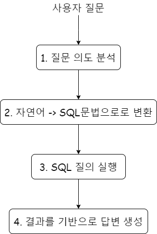

## :book:프로젝트 소개

 이 프로젝트는 사용자가 입력한 질의에 따라 데이터베이스에서 **재무제표 데이터**를 검색하고, 이를 조합하여 답변하는 시스템입니다. 방대한 양의 재무제표 정보를 간단한 문답 형식으로 제공하는 것을 목표로 합니다. 이를 통해 사용자에게 필요한 재무 데이터를 효율적으로 전달할 수 있습니다.

> :link:https://www.dartalert.link/

## 🛠️기술

> 백엔드

Python, FastAPI, Langchain, Openai 

> 프론트엔드

Typescript, React

> 데이터베이스

AWS RDS(Mysql)

> 배포

AWS Lambda, API Gateway, AWS SAM

### :timer_clock:개발 내역

> 프로젝트 초기 제작(2022.08 ~ 2022.09)

- 초기 데이터베이스 스키마 설계
- LangChain RAG 구성
- GPT, Vercel을 이용한 웹사이트 기획 및 구상

## :file_folder: 주요 폴더/파일

1. `langchain_finchat/app/chains`: chain 코드
2. `langchain_finchat/app/db`: 데이터베이스 연결 관리 
3. `langchain_finchat/app/service:` 비지니스 로직 
4. `langchain_finchat/tests`: 웹소켓 테스트 코드

## :hand: 구현 세부사항

1. **질문 의도 분석**: 사용자의 자연어 질문을 분석하여 핵심 정보를 추출하고, 질문의 의도를 파악합니다.
2. **자연어 -> SQL 문법으로 변환**: 분석된 질문을 바탕으로 적절한 SQL 문법을 생성합니다.
3. **SQL 질의 실행**: 변환된 SQL 문을 데이터베이스에 실행하여 요청한 데이터를 조회합니다.
4. **결과를 기반으로 답변 생성**: 조회된 데이터를 바탕으로 사용자가 이해하기 쉽게 답변을 생성하고 전달합니다.

## :mag: 트러블 슈팅

## :gear: 개선 과제

1. **긴 텍스트 처리**: 긴 텍스트를 처리할 때 시간이 오래 걸리는 문제를 해결하기 위해 DB 조회와 답변 생성 과정에서 처리 속도를 개선해야 함.

2. **재무 정보 추가 및 최신화 방법**:

- **데이터 소스 통합**: 다양한 소스에서 재무 정보를 수집하고 이를 하나의 DB로 통합하여 관리.
- **주기적 업데이트**: 주기적으로 재무 데이터를 크롤링하거나 API를 통해 최신 데이터를 가져와 DB를 업데이트.
- **증분 업데이트 방식 적용**: 전체 데이터를 다시 다운로드하는 대신 변경된 부분만 업데이트하는 증분 방식으로 최신화 효율성 향상.
- **데이터 검증 프로세스 도입**: 최신화된 데이터의 정확성을 검증하는 프로세스를 추가하여, 실시간으로 변화하는 재무 정보를 신뢰성 있게 유지.
- **자동화된 배치 작업**: 최신 데이터를 일정 주기로 자동으로 갱신하도록 배치 작업 스케줄을 설정해 관리.

